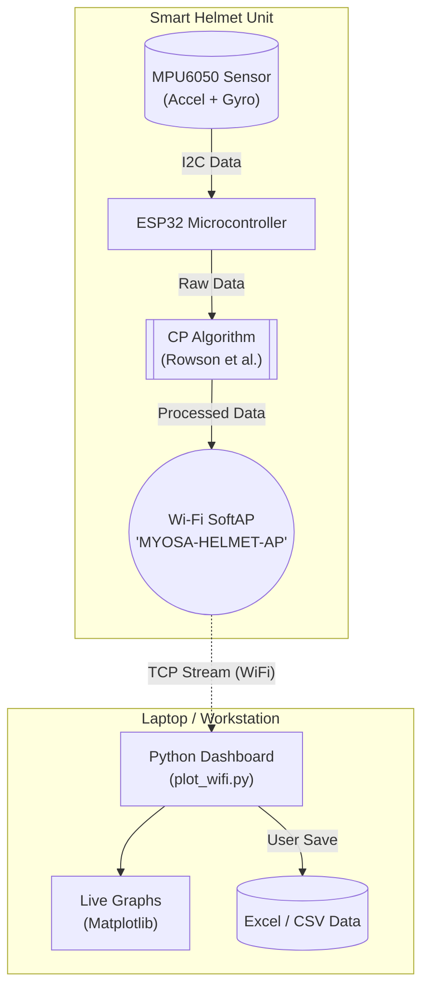

> Protecting athletes with real-time concussion risk analysis.

---

## Acknowledgements
Thanks to the open-source community for the ESP32 and Python libraries that made this project possible. Special reference to Rowson et al. for the concussion probability model used in this system.

---

## Overview
Concussions are a major concern in contact sports, often going undetected until severe symptoms arise. The **Smart Helmet Concussion Monitor** is an IoT-based solution designed to track head impacts in real-time.

Using an **ESP32** microcontroller and an **MPU6050** accelerometer/gyroscope, the system measures both linear acceleration ($g$) and rotational acceleration ($rad/s^2$). It applies the **Rowson et al. Concussion Probability (CP)** formula to estimate the risk of injury for every impact. Data is streamed over **Wi-Fi** to a laptop, where a Python application provides live visualization and data logging capabilities.

**Key features:**
*   **Real-time Monitoring:** Tracks linear and rotational acceleration at high speed.
*   **Concussion Probability (CP):** Instantly calculates injury risk using valid biomechanical models.
*   **Wireless Streaming:** Uses ESP32 SoftAP mode to stream data to a PC via TCP.
*   **Live Dashboard:** Python-based GUI for visualizing impact data and CP spikes.
*   **Data Export:** Saves session data to Excel/CSV for medical or performance analysis.

---

## System Architecture



---

## Demo / Examples

### Images
<p align="center">
  <br/>
  <i>The Smart Helmet system showing the ESP32 and sensor mounted on a helmet.</i>
</p>

### Videos
<div class="youtube-embed">
  <iframe src="https://www.youtube.com/embed/v67hs_dzFAw"></iframe>
</div>

---

## Features (Detailed)

### 1. Dual-Axis Impact Sensing
The system reads raw data from the MPU6050 sensor to calculate:
- **Linear Acceleration:** Magnitude of acceleration in $g$.
- **Rotational Acceleration:** Derived from gyroscope angular velocity, measured in $rad/s^2$.
This ensures a comprehensive view of the forces acting on the head, not just simple impacts.

### 2. Embedded CP Calculation
The ESP32 processes sensor data locally to calculate the Combined Probability of Concussion (CP) using the formula:
$$CP = \frac{1}{1 + e^{-(\beta_0 + \beta_1 a_{linear} + \beta_2 \alpha_{rotational})}}$$
This allows for immediate risk assessment without needing cloud processing.

### 3. Wi-Fi Direct Streaming
To ensure reliability in the field, the helmet creates its own Wi-Fi network (`MYOSA-HELMET-AP`). The Python client connects directly to this network, ensuring low-latency data transmission without needing an external router.

### 4. Data Visualization & Logging
A custom Python tool (`plot_wifi.py`) connects to the helmet, plotting live graphs of:
- Linear Acceleration ($g$)
- Rotational Acceleration ($rad/s^2$)
- Concussion Probability (%)

Users can click **"Save Excel"** to export the current session's data for further analysis.

<p align="center">
  <br/>
  <i>Example of a flagged high-risk impact showing Linear Accel, Rotational Accel, and CP Spike.</i>
</p>

---

## Usage Instructions

### Setting up the Helmet
1.  Power on the ESP32 (via battery bank).
2.  Wait for the Wi-Fi network **`MYOSA-HELMET-AP`** to appear.
3.  Connect your laptop to this network.

### Running the Dashboard
Run the Python script to start receiving data:

```plaintext
python tools/plot_wifi.py
```

The dashboard will open, displaying live sensor data. Perform impacts or movements to see the graphs update. Press **"Save Excel"** to save the recorded data.

---

## Tech Stack
*   **Hardware:** ESP32 Development Board, MPU6050 (6-axis IMU)
*   **Firmware:** C++ (Arduino Framework)
*   **Software:** Python 3.x
*   **Libraries:**
    *   *Arduino:* `WiFi`, `Wire`
    *   *Python:* `matplotlib`, `socket`, `openpyxl`

---

## Requirements / Installation

### 1. Python Dependencies
Install the required libraries for the visualization tool:

```bash
pip install matplotlib openpyxl
```

### 2. Firmware Upload
If you need to re-flash the ESP32:
1.  Open `myosa_accel_plotter/myosa_accel_plotter.ino` in Arduino IDE.
2.  Install the **ESP32 Board Package** and **MPU6050** library.
3.  Select your board and upload.

---

## File Structure
```
/myosa-smart-helmet
  ├─ myosa_accel_plotter/
  │   └─ myosa_accel_plotter.ino    # ESP32 Firmware
  ├─ tools/
  │   └─ plot_wifi.py               # PC Dashboard & Logger
  ├─ helmet-cover.jpg               # Project Image
  ├─ demo-video.mp4                 # Demo Video
  └─ myosa-smart-helmet.md          # This file
```

---

## License
This project is open-source and available for educational and non-commercial use.

---

## Contribution Notes
Feel free to fork this repository and submit pull requests. Future improvements could include SD card logging or BLE support for mobile apps.
